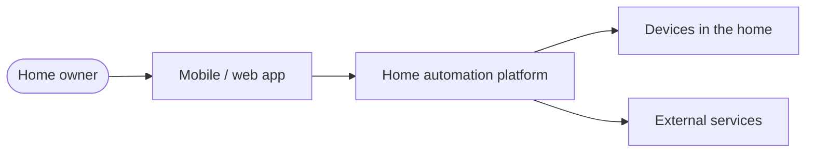
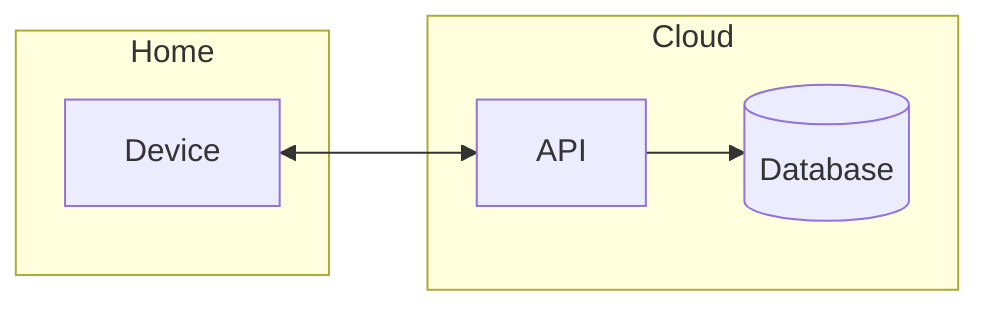

# Kata 01: Lights, Please

> **Status:** In progress · **Timebox:** 2–3 hours · **Original brief:** [Neal Ford's Architectural Katas](https://nealford.com/katas/list.html)

## 1. The brief

A large home-electronics company wants to enter the home-automation market with a new product line: devices that turn lights on and off, lock and unlock doors, show live camera images and control the thermostat, with more device types to come later.

- **Users:** consumers, mostly small families. The company expects to sell thousands of units in the first three years.
- **Requirements:**
  - As close to plug-and-play as possible, but sold as separate modules (camera, lock, thermostat, etc.) that customers can buy one at a time.
  - Devices must be reachable over the Internet for remote monitoring and control, using the customer's existing Wi-Fi.
  - Customers can program how the modules behave, to fit their own needs.
  - Another team builds the hardware. The communication protocol is up to me: they'll implement the device side once I specify it.
- **Business context:**
  - The company is ready to invest heavily to launch this line of business.
  - It wants to collect data from customers who opt in, for wider statistics.
  - It's an international company.

## 2. Questions for the client

<!-- Some areas worth thinking about: what happens when the home Internet connection
     drops; how fast a lock or light must respond; security and certification for door
     locks; video storage and retention; data protection rules in different countries
     (GDPR); firmware updates; how long devices are supported; integration with existing
     ecosystems (voice assistants, Matter); and the business model (one-off purchase vs.
     subscription), which changes how much cloud cost is acceptable. -->

| Question | Why it matters | My assumption |
| --- | --- | --- |
|  |  |  |

## 3. Architecture characteristics

<!-- Candidates to choose from: availability, security, privacy, interoperability,
     extensibility, scalability, elasticity, reliability when offline, deployability
     (over-the-air updates), cost. Pick the top three and say why. -->

| Characteristic | Why it matters here |
| --- | --- |
|  |  |
|  |  |
|  |  |

**Also considered:**

## 4. Components

<!-- Think about where things run: on the device, in the home (is there a hub?),
     in the cloud, and in the customer's app. Which component owns device registration,
     the rules customers program, remote commands, video, telemetry, firmware updates
     and the opt-in statistics? -->

| Component | Responsibility |
| --- | --- |
|  |  |

## 5. Architecture style

<!-- Which style fits, and why? Link the ADR that records the choice. -->

## 6. Diagrams

### System context

### Containers

## 7. Decisions

<!-- Likely candidates for ADRs: hub vs. no hub in the home; the device protocol
     (e.g. MQTT, CoAP, Matter or your own); where customer rules run (device, hub or
     cloud); how video is streamed and stored; how firmware updates are rolled out;
     how opt-in data is separated from personal data. -->

| ADR | Decision | Status |
| --- | --- | --- |
| [0001](adr/0001-title.md) |  | Proposed |

## 8. Risks and trade-offs

## 9. With more time
