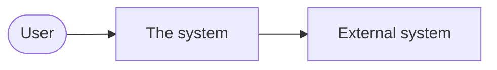
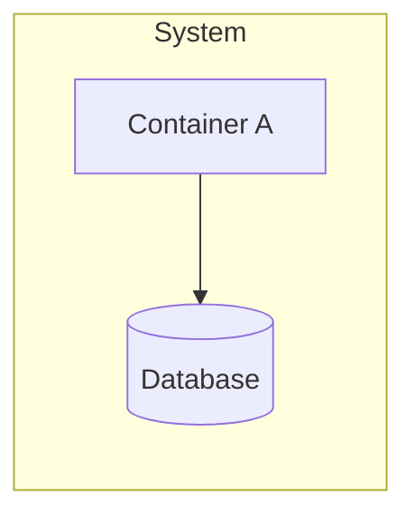

# Kata NN: Kata Name

> **Status:** In progress · **Timebox:** 2–3 hours · **Original brief:** [link](https://nealford.com/katas/list.html)

## 1. The brief

<!-- Summarize the brief in your own words: who the client is, who the users are,
     the requirements and the extra business context. Link to the original above. -->

## 2. Questions for the client

<!-- What would you ask before designing? For each question, write the assumption
     you made, since there's no client to answer it. The questions often show more
     judgment than the diagrams. -->

| Question | Why it matters | My assumption |
| --- | --- | --- |
|  |  |  |

## 3. Architecture characteristics

<!-- Pick the TOP THREE characteristics that drive this design and explain why.
     Mention a few you considered important but ranked lower. -->

| Characteristic | Why it matters here |
| --- | --- |
|  |  |
|  |  |
|  |  |

**Also considered:**

## 4. Components

<!-- The main logical building blocks and what each one is responsible for.
     Start from the requirements and the users' journeys, not from technology. -->

| Component | Responsibility |
| --- | --- |
|  |  |

## 5. Architecture style

<!-- Which overall style fits (layered, modular monolith, microservices, event-driven,
     space-based, ...)? Why does it suit the top three characteristics? Link the ADR. -->

## 6. Diagrams

### System context

### Containers

## 7. Decisions

| ADR | Decision | Status |
| --- | --- | --- |
| [0001](adr/0001-title.md) |  | Proposed |

## 8. Risks and trade-offs

<!-- What could go wrong? What did you deliberately give up, and why is that acceptable? -->

## 9. With more time

<!-- What would you explore, prototype or validate next? -->
